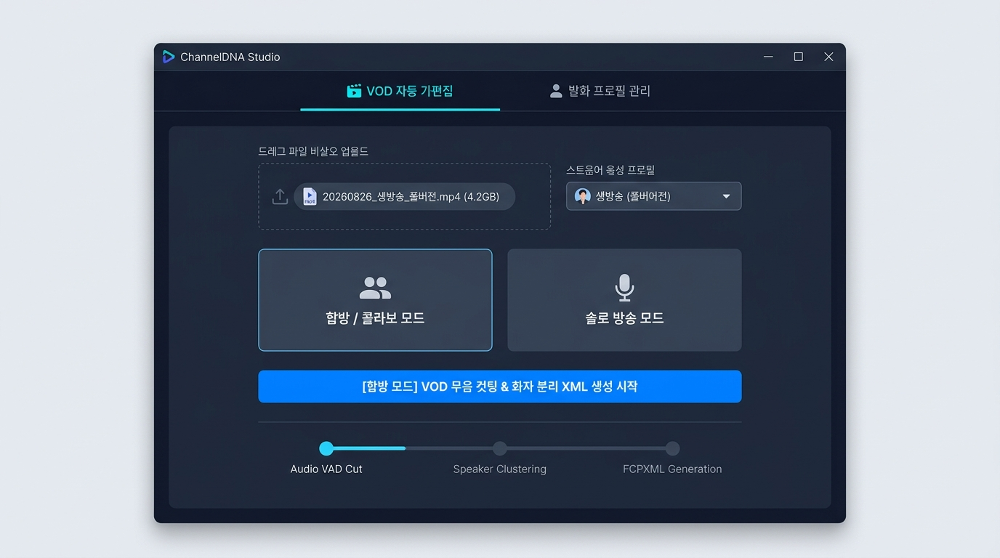

# 🎬 ChannelDNA Studio

  <a href="https://pugori.github.io/roughcut-bot/"><strong>🌐 공식 웹사이트 바로가기</strong></a> •
  <a href="https://github.com/pugori/roughcut-bot/releases/latest"><strong>📦 최신 버전 다운로드</strong></a>

  

---

## ✨ 주요 기능

- **✂️ VOD 무음 구간 자동 컷팅**: 긴 생방송 다시보기의 침묵 및 대기 구간을 자동으로 절삭하여 가편집 시퀀스를 생성합니다.
- **👥 화자 분리 자막 트랙 생성**: 음성 분석을 통해 메인 화자와 게스트 자막을 독립 트랙(V2, V3, V4)으로 자동 분리 배치합니다.
- **📄 편집기 원클릭 타임라인 연동**: 공개 표준 Final Cut Pro XML(xmeml v4) 및 SRT 자막을 출력하여 Premiere Pro 및 DaVinci Resolve에서 즉시 본편집을 시작할 수 있습니다.
- **🔒 로컬 보안 샌드박스**: 원본 동영상 파일이 외부로 전송되지 않으며, 사용자 로컬 PC 환경에서 독립적으로 실행됩니다.

---

## 🚀 빠른 시작

1. [최신 릴리즈](https://github.com/pugori/roughcut-bot/releases/latest)에서 **`ChannelDNA.exe`**를 다운로드합니다.
2. 실행 후 가편집할 VOD 영상 파일(`.mp4`, `.mkv`, `.mov`)을 선택합니다.
3. 원하는 방송 모드(**합방 모드** / **솔로 모드**)를 선택하고 **[가편집 시작]**을 클릭합니다.
4. 생성이 완료된 XML 파일을 영상 편집 프로그램으로 드래그하여 본편집을 진행합니다.

---

  © 2026 ChannelDNA Project. All rights reserved. 
  Adobe®, Premiere Pro®는 Adobe Inc.의 등록 상표이며, DaVinci Resolve®는 Blackmagic Design Pty. Ltd.의 등록 상표입니다. 
  본 소프트웨어는 공개 표준 XML 포맷 호환성을 지원하는 독립 보조 도구입니다.

